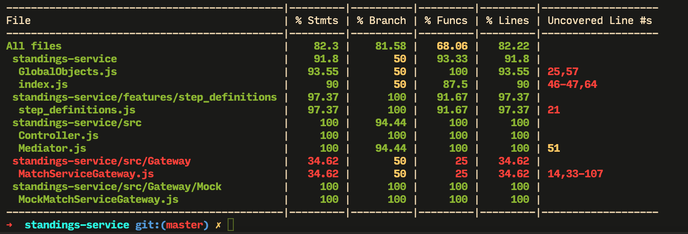

# Docs

## Coverage

### Coverage before refactoring

| File                                        | % Stmts | % Branch | % Funcs | % Lines | Uncovered Line #s |
| ------------------------------------------- | ------- | -------- | ------- | ------- | ----------------- |
| All files                                   | 82.3    | 81.58    | 68.06   | 82.22   |                   |
| standings-service                           | 91.8    | 50       | 93.33   | 91.8    |                   |
| GlobalObjects.js                            | 93.55   | 50       | 100     | 93.55   | 25,57             |
| index.js                                    | 90      | 50       | 87.5    | 90      | 46-47,64          |
| standings-service/features/step_definitions | 97.37   | 100      | 91.67   | 97.37   |                   |
| step_definitions.js                         | 97.37   | 100      | 91.67   | 97.37   | 21                |
| standings-service/src                       | 100     | 94.44    | 100     | 100     |                   |
| Controller.js                               | 100     | 100      | 100     | 100     |                   |
| Mediator.js                                 | 100     | 94.44    | 100     | 100     | 51                |
| standings-service/src/Gateway               | 34.62   | 50       | 25      | 34.62   |                   |
| MatchServiceGateway.js                      | 34.62   | 50       | 25      | 34.62   | 14,33-107         |
| standings-service/src/Gateway/Mock          | 100     | 100      | 100     | 100     |                   |
| MockMatchServiceGateway.js                  | 100     | 100      | 100     | 100     |                   |
